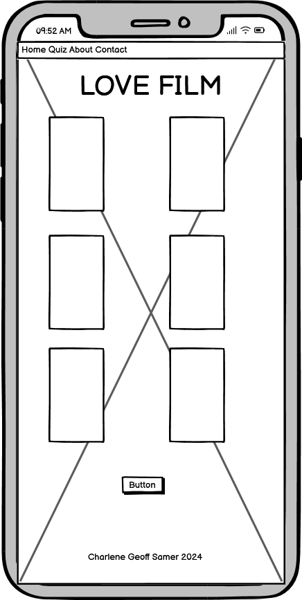
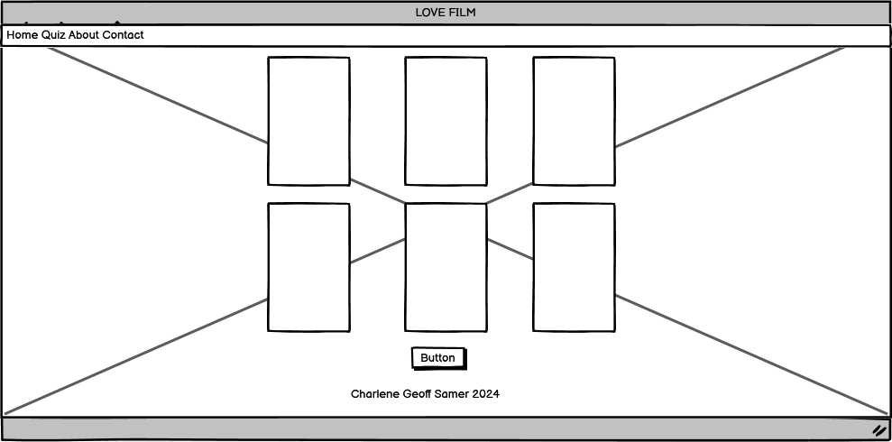

README

### Love-Film

Love-Film is a movie quiz website for people who love films of all sorts of genres. It is designed to offer tailored quizzes at a customisable difficulty level that will hopefully both engage and intrigue participants, offering a combination of challenge, fun and entertainment to those who enjoy film trivia.
One of the big ideas for this site is for it to have great avenues for expandability offering more and more content overtime so players can keep coming back since the expanse of film facts is almost endless. This includes adding new genres overtime and potentially even incorporating A.I. question card generation (maybe with a curated aspect) to make almost infinite content at some point in the future. We have given players a way to track their progress to add a sense of building acheivement as they answer more questions and also our victory reward images upon getting correct answers to add value as they go about playing.

Here is my deployed site on [https://ui.dev/amiresponsive?url=https://geoff-fletcher.github.io/Love-Film/](https://ui.dev/amiresponsive?url=https://geoff-fletcher.github.io/Love-Film/)

---

## UX

This website was designed to represent a classic old school Hollywood style cinema with the question genre selecting cards looking like exciting posters from the genre they represent. Our quiz is based on film which has a huge visual component and a big part of the fun in a film quiz is reminiscing over the great visual aspect of the films we enjoy; it is important that the website convey this excitement to the player. The classic reds and golds of a glamourous old cinema give a tried and tested colour scheme to inform the basis of our color palette but we have also worked to keep contrast high for both clarity and accessibility.

---

## Color Scheme

The contrast color scheme is designed to make it easy for users to navigate and draw the eye round the page. The color scheme makes the actions on the website really draw the eye and easy to identify which I think helps suggest the idea that Prevent is an active duty and that the user should feel confident to do what they think is necessary.

I used Coolors [https://coolors.co/1f1f1f-a7a7a7-f05f40-df4929-ebebeb](https://coolors.co/1f1f1f-a7a7a7-f05f40-df4929-ebebeb) to generate the color palette for this website.

---

## Typography

I used Google Fonts to provide Roboto as the primary font for this site. I think this is a great choice since it is bold, easy to read and appropriately business like for what is a serious topic. I used Fontawesome for my icion which are mostly just for social media links for this site.

[Fontawesome](https://fonts.google.com/)

[Google Fonts](https://fontawesome.com/)

---

## Wireframes

I used [Balsamiq](https://balsamiq.cloud/). to mock up all the wireframes for this project which went for a mobile 1st design but i also built in versatility to give myself an idea what i wanted for both larger tablets and desktops.

---

## Project Board

## Features/ User stories

Love Film lets the quiz player select from 6 different fil genres to answer questions on with over 240 questions in total and will be able to add to that in the future. It totals up your score with a congratulations screen but further down the line will aim to offer a number of rare or cool film images as rewards in each genre depending how well the player does.

## Tools & Technologies Used

- [HTML](https://en.wikipedia.org/wiki/HTML) used for the main site content.
- [CSS](https://en.wikipedia.org/wiki/CSS) used for the main site design and layout.
- [CSS Flexbox](https://www.w3schools.com/css/css3_flexbox.asp) used for an enhanced responsive layout.
- [CSS Grid](https://www.w3schools.com/css/css_grid.asp) used for an enhanced responsive layout.
- [Git](https://git-scm.com) used for version control. (`git add`, `git commit`, `git push`)
- [GitHub](https://github.com) used for secure online code storage.
- [GitHub Pages](https://pages.github.com) used for hosting the deployed front-end site.
- [Gitpod](https://gitpod.io) used as a cloud-based IDE for development.
- [Balsamiq](https://balsamiq.com/wireframes/desktop/#) to create wireframes.
- [Google Fonts](https://www.fonts.google.com) to pick my font.
- [fontawesome](https://fontawesome.com/) to pick choose my icons.
- [Am I Responsive](https://ui.dev/amiresponsive) for my own mockups on various screen sizes.
---

## Testing
Testing is included in the seperate file [TESTING.md](TESTING.md)

## Deployment

The site was deployed to GitHub Pages. The steps to deploy are as follows:
- In the [GitHub repository](https://github.com/Geoff-Fletcher/Prevent-Project), navigate to the Settings tab 
- From the source section drop-down menu, select the **Main** Branch, then click "Save".
- The page will be automatically refreshed with a detailed ribbon display to indicate the successful deployment.

The live link can be found [here](https://geoff-fletcher.github.io/Prevent-Project/)

### Local Deployment

This project can be cloned or forked in order to make a local copy on your own system.

#### Cloning

You can clone the repository by following these steps:

1. Go to the [GitHub repository](https://github.com/Geoff-Fletcher/Prevent-Project) 
2. Locate the Code button above the list of files and click it 
3. Select if you prefer to clone using HTTPS, SSH, or GitHub CLI and click the copy button to copy the URL to your clipboard
4. Open Git Bash or Terminal
5. Change the current working directory to the one where you want the cloned directory
6. In your IDE Terminal, type the following command to clone my repository:
	- `git clone https://github.com/Geoff-Fletcher/Prevent-Project.git`
7. Press Enter to create your local clone.

Alternatively, if using Gitpod, you can click below to create your own workspace using this repository.

Please note that in order to directly open the project in Gitpod, you need to have the browser extension installed.
A tutorial on how to do that can be found [here](https://www.gitpod.io/docs/configure/user-settings/browser-extension).

#### Forking

By forking the GitHub Repository, we make a copy of the original repository on our GitHub account to view and/or make changes without affecting the original owner's repository.
You can fork this repository by using the following steps:

1. Log in to GitHub and locate the [GitHub Repository](https://github.com/Geoff-Fletcher/Prevent-Project)
2. At the top of the Repository (not top of page) just above the "Settings" Button on the menu, locate the "Fork" Button.
3. Once clicked, you should now have a copy of the original repository in your own GitHub account!

## Citations
The websites and resources listed here were used to educate and inspire the production of this site and where listed provide snippets of code and/or act a tutorials in how to craft certain elements of the project:

 # Coding Resources
- [W3 Schools](https://www.w3schools.com/)
- [Markdown Guide](https://www.markdownguide.org/)
- [Bootstrap](https://getbootstrap.com/)

- # Content Resources
- [ChatGPT](https://chatgpt.com/)
-

---

## Acknowledgements

Big Thanks to my September 2024 Bootcamp 1 course mates for putting up with my nonsense when it comes to question time!
Coding Coach John Reardon whom really helped with a bunnch of my bootstrap queries, and Shelley Maughan (my tutor) who helped in many, many ways and whos great README inspired this and who I borrowed a bunch of my Tech and deployment links from (You saved me a lot of typing)

---
